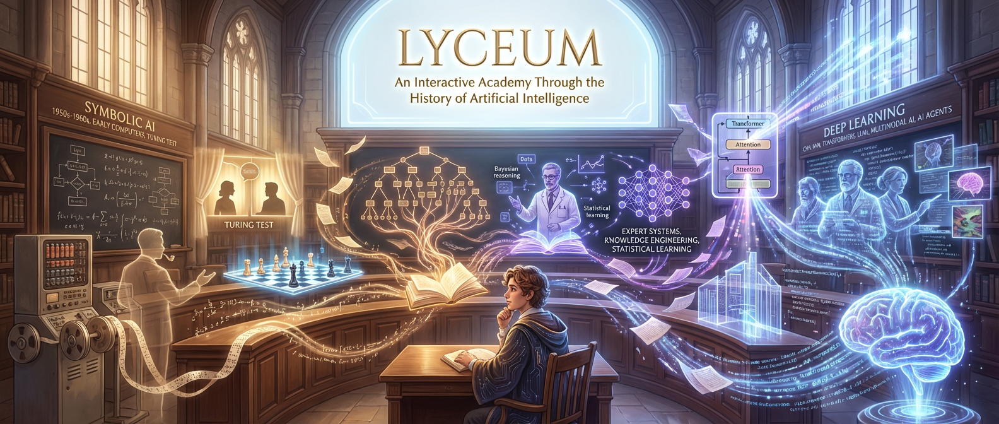

# 璃曦学园 (Lyceum)
### 一部交互式小说，通过课堂对话讲述人工智能的发展史。

[在线体验](https://lyceum.c01dkit.com) | [English README](./README.md)

    

---

## 这是什么？

璃曦学园是一个基于网页的交互式小说项目。你将以学生身份进入一所跨越时代的虚拟学校，在 20 位以真实 AI 先驱为原型的教授的课堂上，通过对话、选择和思考，从零开始了解人工智能的前世今生。

从图灵 1950 年代的思想实验到今天的大语言模型和 AI 智能体，璃曦学园用 **5 个年级、20 门课程、116 节课、266 条术语** 串联起人工智能七十年的发展历程，全部内容中英双语。

## 为什么做这个项目？

- **以故事代替教科书** — 每个概念都通过叙事引入，而非干巴巴的定义
- **在思考中学习** — 选择题让你与先驱们一起推理和反思
- **零门槛** — 无需任何 AI 背景知识，从头开始自然建立理解

## 为什么起这个名字？

* 璃  → 琉璃、玻璃 → 硅、晶体 → 芯片、硅基智能
* 曦  → 晨曦、日光 → 阿波罗（光明之神）→ Lyceum 的词源

「晨光穿过琉璃」是为纯粹的美，「璃」寓意硅基（AI的物质载体），「曦」寓意光明初现（智能的觉醒）。晨曦透过琉璃窗洒进学学园，如同智慧逐渐被启蒙。

## 课程体系

| 年级 | 时代 | 课程 | 教授 |
|------|------|------|------|
| 一年级 | 1950s–1960s | 图灵测试、符号AI与推理、第一批AI程序 | 图灵、麦卡锡、西蒙 |
| 二年级 | 1970s–1980s | 专家系统、知识工程、AI寒冬 | 费根鲍姆、肖特利夫、明斯基 |
| 三年级 | 1986–2005 | 神经网络复兴、统计学习、贝叶斯推理、集成方法 | 鲁梅尔哈特、瓦普尼克、珀尔、布雷曼 |
| 四年级 | 2006–2020 | 深度学习、CNN(LeNet→ResNet)、RNN/LSTM/注意力、GAN、深度强化学习 | 辛顿、勒丘恩、本吉奥、古德费洛、西尔弗 |
| 五年级 | 2017–至今 | Transformer、大语言模型、对齐与安全、多模态、AI智能体 | 瓦斯瓦尼、苏茨克维、罗素、李飞飞、吴恩达 |

## 参与贡献

欢迎贡献！你可以：

- **反馈问题** — 错别字、事实错误、翻译问题
- **完善内容** — 新术语词条、课程文本改进
- **优化界面** — 无障碍、移动端体验、动画效果

## 免责声明

本项目的所有内容（包括课堂对话、术语词条、教授人设等）均由 **AI 自主生成**，人工校验不完全。虽然我们尽力保持历史准确性，但部分细节可能存在不完整、不准确或为了叙事效果而简化的情况。璃曦学园是一个**寓教于乐的体验项目，不应作为权威学术来源**。如需严谨学习，请查阅原始论文、教科书和同行评审的学术资料。

项目作者与贡献者**不对因使用本项目内容而产生的任何决策、行为或后果负责**。教授角色是受真实先驱启发的虚构形象，不代表其真实观点或言论。

---

怀着对过去的好奇和对未来的乐观而构建。

